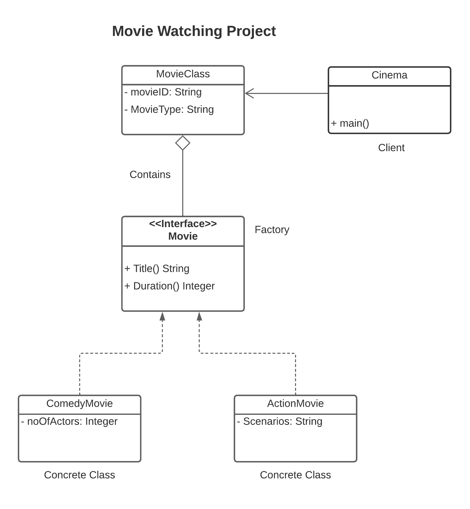

## Problem Scenario
Implement factory design pattern using Movie watching as the factory interface. The interface implements two methods: Title() and duration().

ComedyMovie and ActionMovie are concrete objects that implements Movie interface.

MovieClass holds attributes such as MovieID and MovieType.

Cinema would be the client object.

Refer to the UML Class Diagram

## UML Class Diagram

